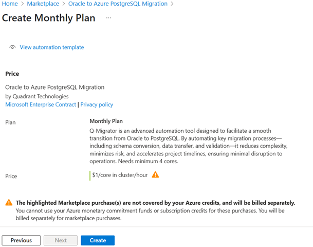

# Deploy QMigrator on Azure Kubernetes Service (AKS) from Azure Marketplace

This guide explains how to deploy QMigrator on Azure Kubernetes Service (AKS) using the QMigrator Marketplace Helm chart. It also covers basic usage, including creating and consuming messages.

## Prerequisites

Ensure you have the following before starting:

- **AKS cluster:** An existing Azure Kubernetes Service cluster, or permissions/ability to provision one during deployment.
- **kubectl:** The Kubernetes CLI, installed and configured for your cluster. Install it using `az aks install-cli` if needed.
- **Project details:** Project ID, name, and credentials from Quadrant.

## Deployment Steps

1. In Azure Marketplace, search for **"Oracle to Azure PostgreSQL Migration"**.
2. Select the plan and click **Create**.

    
3. Enter your subscription and resource group details.
4. Choose to create a new AKS cluster or use an existing one.

    
5. Configure the new cluster: node size, Kubernetes version, OS, and autoscaling options.

    
6. Provide QMigrator details from Quadrant, set a database password, enable Airflow for scalable migrations, and airflow password.

    
7. Review your configuration, contact information, and pricing.
8. Once verified, Click **Create** to begin deployment.

    

## Post-Deployment Steps

### Check Pod Status

1. List pods created by the deployment:
    ```sh
    kubectl get pods -n qmigrator-migration
    ```
    

2. To expose QMigrator externally, follow the [Gateway Guide](../../example/gatewayapi/README.md) for gateway configuration, or refer to the [Ingress Guide](../../example/ingress/README.md) for legacy ingress setup (deprecated).
